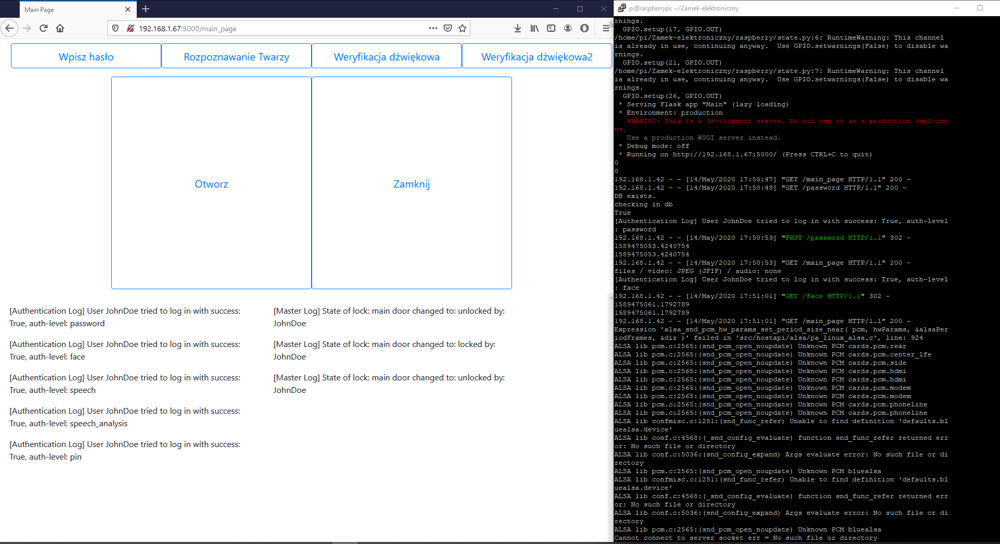

Projekt zaliczneniowy w ramach kursu Projekt Inżynierski prowadzonego na Uniwersytecie Pedagogicznym im. KEN w Krakowie, na kierunku Informatyka.

  Celem projektu było skonstruowanie układu zamka elektronicznego uwzględniającego wielopozio-mową kontrolę dostępu. Zadaniem konstruktora było zaprojektowanie i zmontowanie układu z czte-rorostopniową kontrolą dostępu składającą się z następujących elementów:
    •logowanie za pomocą nazwy użytkownika i hasła,
    •rozpoznawanie twarzy,
    •weryfikacji hasła głosowego oraz głosu użytkownika,
    •podania kodu pin z klawiatury numerycznej.
  Po pozytywnym przejściu wymienionych kroków autentykacji, użytkownik może otworzyć lub zamknąćzamek szyfrowy, reprezentowany przez ruch serwomechanizmu oraz zmianę koloru diody RGB.

## Przykładowy widok projektu

## [Dokumentacja Projektu](https://paarzivall.github.io/Zamek-elektroniczny/)

## Wymagane biblioteki:
Zobacz [plik requirements](./requirements.txt).

## Autorzy
* [Alicja Gałaszkiewicz (@alicjagal)](https://github.com/alicjagal)
* [Mateusz Bugaj (@Paarzivall)](https://github.com/Paarzivall)

## Licencja

Zobacz [plik LICENSE](./LICENSE). TL;DR - licencja MIT
